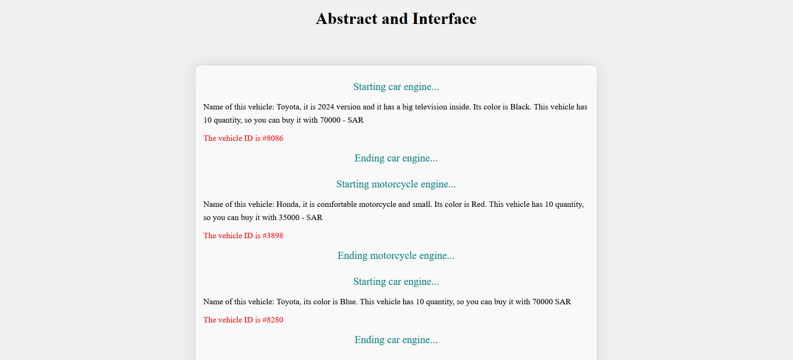
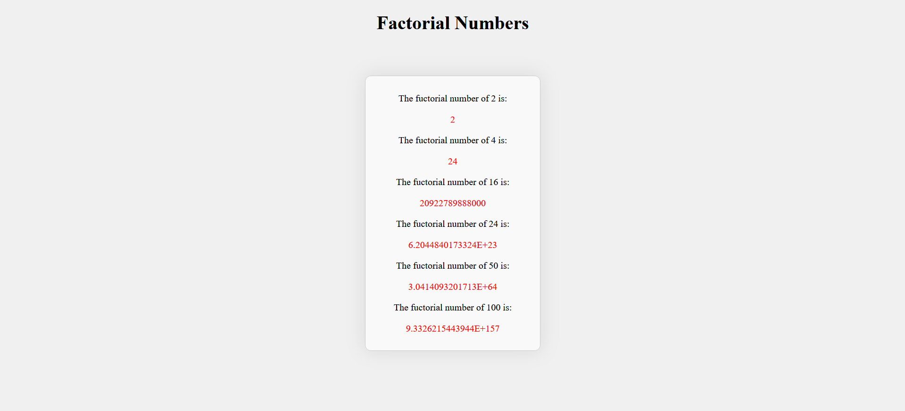
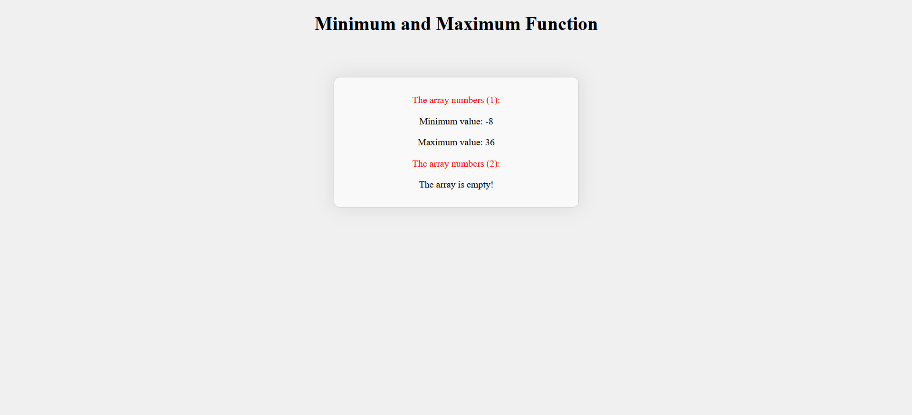
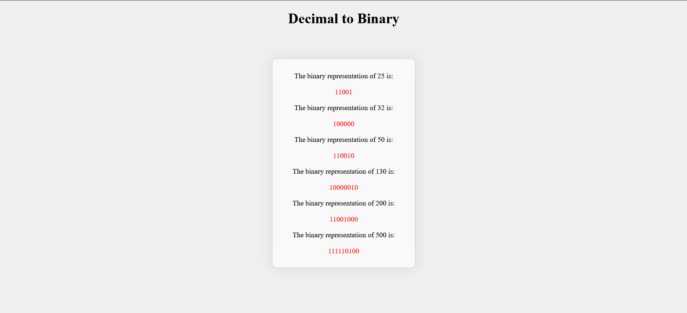
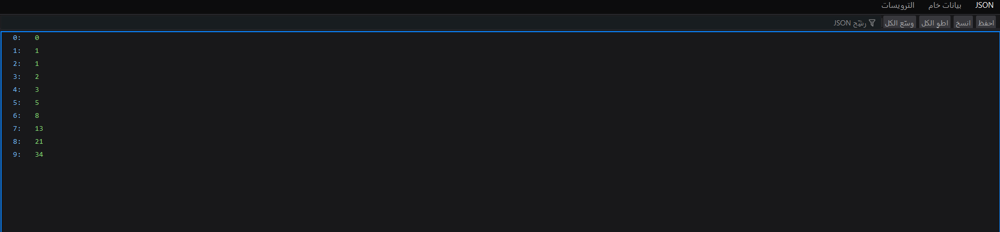
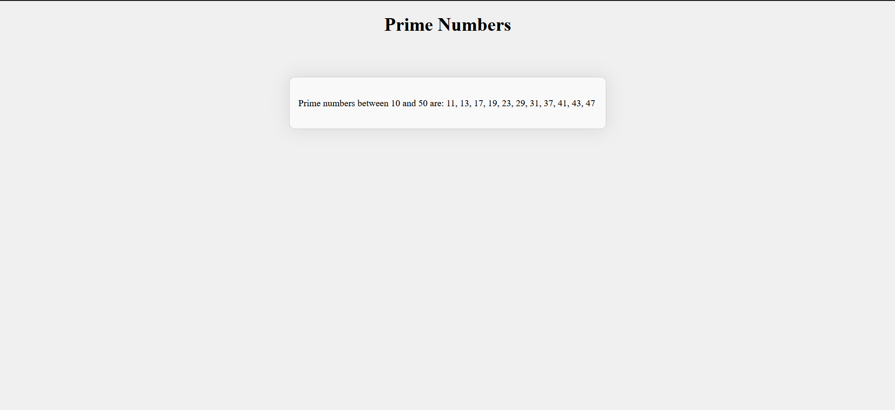
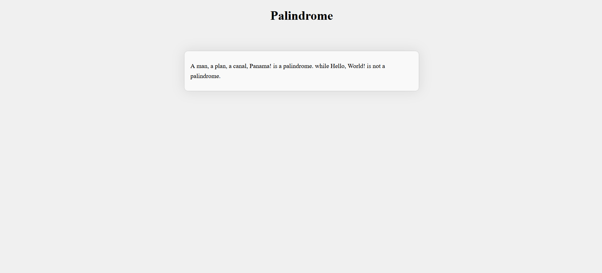

<h1> Backend Engineer using Laravel and php</h1>

 Here the answer of all questions bellow with their pictures:

## 1- Abstract and Interface
[Answer1 Code]([https://github.com/Re21nad/Backend-Engineer--php--Laravel-/blob/main/AbstractClass_vs_Interface.php])
 

## 2- Recursive Factorial Function

## 3- Find Max and Min in Array

## 4- Decimal to Binary Conversion

## 5- Fibonacci Sequence (Laravel Way)

## 6- Find Prime Numbers in a Range

## 7- Palindrome Check

